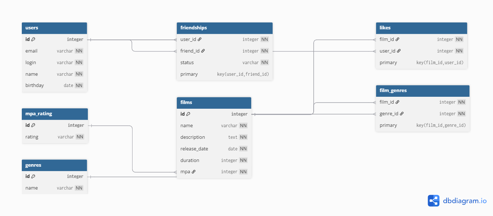

# Filmorate: 
ER-диаграмма базы данных



Проект Filmorate — социальный сервис для оценки фильмов и взаимодействия между пользователями.

Основные таблицы:

- `users` — информация о пользователях
- `films` — фильмы с описанием, длительностью и рейтингом MPA
- `mpa_rating` — возрастные рейтинги (G, PG, PG-13, R, NC-17)
- `genres` — жанры фильмов
- `film_genres` — связь many-to-many между фильмами и жанрами
- `likes` — лайки пользователей к фильмам
- `friendships` — статус дружбы между пользователями (PENDING, CONFIRMED)

## Примеры SQL-запросов

### Все фильмы с жанром "Комедия"

```sql
SELECT f.*
FROM films f
JOIN film_genres fg ON f.id = fg.film_id
JOIN genres g ON fg.genre_id = g.id
WHERE g.name = 'Комедия'
```
Фильмы, понравившиеся пользователю с id = 1
```SELECT f.*
FROM films f
JOIN likes l ON f.id = l.film_id
WHERE l.user_id = 1;
```
Подтверждённые друзья пользователя с id = 1
```
SELECT u.*
FROM users u
JOIN friendships f ON u.id = f.friend_id
WHERE f.user_id = 1 AND f.status = 'CONFIRMED';
```
Топ-10 фильмов по числу лайков
```
SELECT f.*, COUNT(l.user_id) AS likes_count
FROM films f
LEFT JOIN likes l ON f.id = l.film_id
GROUP BY f.id
ORDER BY likes_count DESC
LIMIT 10;
```